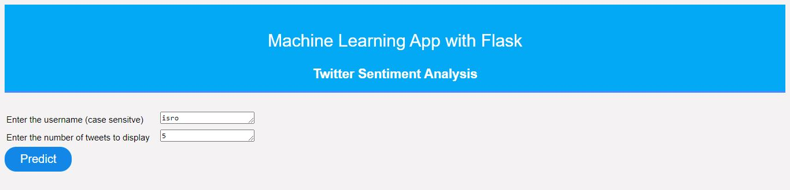
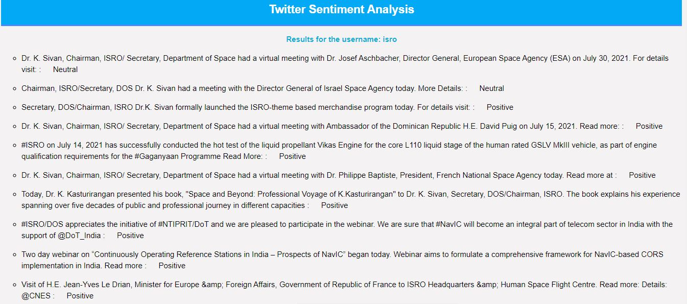

# Twitter Sentiment Analysis
This app is built using flask and uses the twitter API to get live tweets from Twitter.   
The app then classifies whether the tweet is positive, negative or neutral based on the polarity score generated.   
   
 The app in generalized towards the entirety of Twitter and also considers emojis while calculating the polarity score. The app can be tweaked to predict more accurately for a specific target audience.

<h2>Homepage</h2>

Add the username for the twitter account you want to get tweets from and enter the number of tweets to be displayed.

<h2>Results</h2>

The app then displays the desired number of tweets along with it's sentiment.

